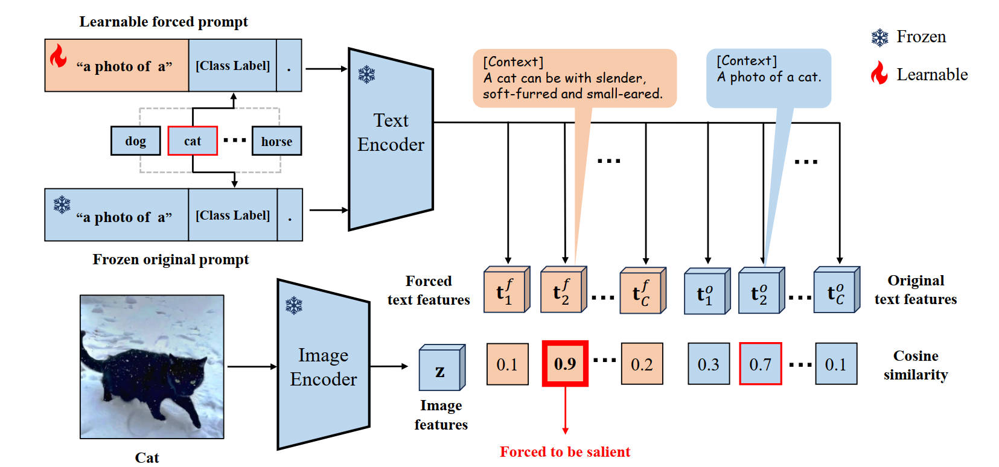

# FA: Forced Prompt Learning of Vision-Language Models for Out-of-Distribution Detection

The paper has been accepted by ICCV2025  
Arxiv: https://arxiv.org/abs/2507.04511

## Requirements
#### Installation
Create a conda environment and install dependencies (you do not need to install the toolbox Dassl.pytorch first):
```bash
pip install -r requirements.txt
```

## Get Started
### Configs
The running configurations can be modified in `configs/my_config.yaml`.  
The ID dataset configurations can be modified in `my_dataset/`.

### Train
```bash
CUDA_VISIBLE_DEVICES=3 python main.py --config configs/my_config.yaml --is_train 1
```

### :blue_book: Models Zoo

- ID: ImageNet-1K, backbone: ViT-B/16
<table>
    <tr align="center">
        <td rowspan="2">K</td>
        <td colspan="2">iNaturalist</td>
        <td colspan="2">SUN</td>
        <td colspan="2">Places</td>
        <td colspan="2">Textures</td>
        <td colspan="2">Avg</td>
        <td rowspan="2">Model/log</td>
    </tr>
    <tr align="center">
       <td>FPR95</td>
       <td>AUROC</td>
       <td>FPR95</td>
       <td>AUROC</td>
       <td>FPR95</td>
       <td>AUROC</td>
       <td>FPR95</td>
       <td>AUROC</td>
       <td>FPR95</td>
       <td>AUROC</td>
    </tr>
    <tr align="center">
       <td>2</td>
       <td>12.53</td>
       <td>96.92</td>
       <td>26.68</td>
       <td>93.67</td>
       <td>31.19</td>
       <td>92.16</td>
       <td>29.82</td>
       <td>92.53</td>
       <td>25.06</td>
       <td>93.82</td>
       <td><a href="https://drive.google.com/drive/folders/1XXhQKazrTgcbDJHezCN3DGgUQcOhoAON?usp=drive_link">here</a></td>
    </tr>
    <tr align="center">
       <td>3</td>
       <td>15.66</td>
       <td>96.23</td>
       <td>26.57</td>
       <td>93.66</td>
       <td>29.51</td>
       <td>92.82</td>
       <td>28.48</td>
       <td>93.14</td>
       <td>25.05</td>
       <td>93.96</td>
       <td><a href="https://drive.google.com/drive/folders/1zrzIgwNzkMpkbTj6RGh1V3cIfoech8NU?usp=drive_link">here</a></td>
    </tr>
    <tr align="center">
       <td>4</td>
       <td>16.44</td>
       <td>96.30</td>
       <td>27.96</td>
       <td>93.54</td>
       <td>30.99</td>
       <td>92.60</td>
       <td>26.37</td>
       <td>93.95</td>
       <td>25.44</td>
       <td>94.10</td>
       <td><a href="https://drive.google.com/drive/folders/11RYIngXHH-ITCgH9X9jXKFJfZa9EllD6?usp=drive_link">here</a></td>
    </tr>
</table>


### Inference
```bash
CUDA_VISIBLE_DEVICES=2 python main.py --config configs/my_config.yaml --is_train 0
```
The specific paths for different OOD datasets can be modified in the inference section of the `main.py` code.


